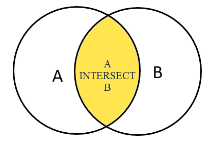

- [Postgres](#postgres)
  - [Postgresql](#postgresql)
    - [Getting Started with PostgreSQL](#getting-started-with-postgresql)
    - [Querying Data](#querying-data)
      - [`expressions` ( concatenation operator, aliases)](#expressions--concatenation-operator-aliases)
      - [`order by`](#order-by)
      - [`distinct`](#distinct)
      - [`where`](#where)
      - [`limit`](#limit)
      - [`fetch`](#fetch)
      - [`in`](#in)
      - [`between` - Data between range - inclusive](#between---data-between-range---inclusive)
      - [`like` - String regex manipulation `%xyz%`](#like---string-regex-manipulation-xyz)
      - [`null`](#null)
      - [`aliases `](#aliases)
      - [`group by`](#group-by)
      - [`having`](#having)
    - [Joins](#joins)
      - [Inner join](#inner-join)
      - [Left join](#left-join)
      - [Right join](#right-join)
      - [Full Outer Join](#full-outer-join)
      - [Self Join](#self-join)
      - [Cross join](#cross-join)
      - [Natural Join](#natural-join)
    - [Set Operations](#set-operations)
      - [Union](#union)
      - [Intersect](#intersect)

# Postgres

## Postgresql

### Getting Started with PostgreSQL

- Open source
- multi-version concurrency control (MVCC) feature
- custom data types

### Querying Data

#### `expressions` ( concatenation operator, aliases)

```sql
SELECT first_name || ' ' || last_name AS full_name FROM customer;

SELECT  5 * 3  AS result;
```

#### `order by`

```sql
SELECT c1, c2 
FROM table
ORDER BY c1 ASC, c2 DESC;
```

#### `distinct` 

```sql
SELECT DISTINCT column_1, column_2 FROM table_name;

SELECT DISTINCT ON (column_1) column_alias, column_2 FROM table_name;
```
    
#### `where`

`=` , `>` , `<` , `>=` , `<=` , `<> or !=` , `AND` , `OR` , `IN` , `LIKE` , `BETWEEN`

```sql
    SELECT * FROM table
    WHERE 
    (
        c1 = 'one' AND 
        c2 >= 10 AND 
        c3 <> 4
    ) 
    OR
    (
        c4 IN (1, 2, 3) AND 
        c5 LIKE '%some%' AND 
        c6 BETWEEN 1 AND 10
    )
```

#### `limit`

- Subset of query 
- skip first rows with `OFFSET`
- Recommend to use with `ORDER BY` to get same or each time
- `NOT SQL STANDARD`
    
```sql
SELECT * FROM table ORDER BY id LIMIT 10 OFFSET 2
```

#### `fetch`

* Recommend to use with `ORDER BY` to get same or each time
* Similar to `LIMIT` clause
* Use `OFFSET` and `FETCH` in any order in psql - in sql OFFSET should be first.

```sql
SELECT * from table
ORDER BY id 
OFFSET 5 ROWS 
FETCH FIRST 5 ROW ONLY; 
```

#### `in`

```sql
value IN (value1,value2,...);
value NOT IN (1, 2);
value IN (SELECT value FROM tbl_name);
```

#### `between` - Data between range - inclusive

```sql
value BETWEEN low AND high;
value >= low and value <= high
value NOT BETWEEN low AND high;
```

#### `like` - String regex manipulation `%xyz%`

* Percent ( %)  for matching any sequence of characters.
* Underscore ( _)  for matching any single character.
* `ILIKE` - psql operator to match pattern with case sensetive 
* postgreSQL also provides some operators that act like the LIKE, NOT LIKE, ILIKE and NOT ILIKE operator as shown below:

  *  `~~` is equivalent to `LIKE`
  *  `~~*` is equivalent to `ILIKE`
  *  `!~~` is equivalent to NOT `LIKE`
  *  `!~~*` is equivalent to NOT `ILIKE`

```sql
string LIKE pattern
string NOT LIKE pattern
SELECT
'foo' LIKE 'foo', -- true
'foo' LIKE 'f%', -- true
'foo' LIKE '_o_', -- true
'bar' LIKE 'b_'; -- false
```

#### `null`

- NULL means missing or not applicable information.
- `NULL` , `IS NULL` , `NOT NULL` , `IS NOT NULL`

```sql
value IS NULL
value = NULL
value IS NOT NULL
```

#### `aliases `

- `AS` keyword
- Without AS keyword
- Often used in `JOIN` query to specify shothand name for table

```sql
-- Column alias
SELECT column_name alias_name FROM table;
SELECT first_name || ' ' || last_name AS full_name FROM customer

-- Table alias
SELECT column_list FROM table_name AS alias_name;
SELECT a_very_long_table_name.column_name FROM a_very_long_table_name;
SELECT t.column_name FROM a_very_long_table_name t;

-- table alias in join
SELECT t1.column_name, t2.column_name
FROM table_name1 t1
INNER JOIN table_name2 t2 ON join_predicate;
```

#### `group by`

- divides rows into groups and applies an aggregate function on each.
- To filter groups, you use the HAVING clause instead of WHERE clause.
- Aggregate functions
    - `COUNT`
    - `SUM`
    - `MAX`
    - `MIN`
    - `SUM`

```sql
SELECT column_1, aggregate_function(column_2)
FROM tbl_name
GROUP BY column_1;
```

#### `having`

- applies the condition for groups.
- The `HAVING` clause sets the condition for group rows created by the `GROUP BY` clause after the `GROUP BY` clause applies while the `WHERE` clause sets the condition for individual rows before `GROUP BY` clause applies.

```sql
SELECT column_1, aggregate_function (column_2)
FROM tbl_name
GROUP BY column_1
HAVING condition;

-- example
SELECT customer_id, SUM (amount)
FROM payment
GROUP BY customer_id
HAVING SUM (amount) > 200;
```

### Joins

- combine columns from one (self-join) or more tables based on the values of the common columns between the tables. 
- The common columns are typically the `primary key` columns of the first table and `foreign key` columns of the second table.

#### Inner join


- Join two or more table
- Get result residing on all table in join
- To join the three tables, you place the second INNER JOIN clause after the first INNER JOIN clause as the following query:

```sql
SELECT A.pka, A.c1, B.pkb, B.c2
FROM A
INNER JOIN B ON A .pka = B.fka;

-- example

SELECT customer.customer_id, payment.amount,
FROM customer
INNER JOIN payment ON payment.customer_id = customer.customer_id
ORDER BY customer.customer_id;

-- three table join 
SELECT customer.customer_id, staff.name, payment.amount
FROM customer
INNER JOIN payment ON payment.customer_id = customer.customer_id
INNER JOIN staff ON payment.staff_id = staff.staff_id;
-- To join more than three tables, you apply the same technique.
```

#### Left join


- The `RIGHT JOIN` clause returns all rows in the right table `B` that are combined with rows in the left table `A` even though there is no corresponding rows in the left table `A`
- Soem rows in the right table might not have values in left table - the values of those coumns will be `NULL`
- You can add `WHERE` clause to filter such `NULL` records
  
```sql
-- example

SELECT film.film_id, film.title, inventory_id
FROM film
RIGHT JOIN inventory ON inventory.film_id = film.film_id;
```

#### Right join


- The `LEFT JOIN` clause returns all rows in the left table `A` that are combined with rows in the right table `B` even though there is no corresponding rows in the right table `B`
- Soem rows in the left table might not have values in right table - the values of those coumns will be `NULL`
- You can add `WHERE` clause to filter such `NULL` records
  
```sql
-- example

SELECT film.film_id, film.title, inventory_id
FROM film
LEFT JOIN inventory ON inventory.film_id = film.film_id;
```

#### Full Outer Join


- The result includes the matching rows from the both tables, and also the rows that do not match.
- 

```sql
-- The OUTER keyword is optional.
SELECT * FROM A FULL [OUTER] JOIN B on A.id = B.id;

-- example

SELECT employee_name, department_name
FROM employees e
FULL OUTER JOIN departments d ON d.department_id = e.department_id;
```

#### Self Join

- A self-join is a query in which a table is joined to itself. Self-joins are useful for comparing values in a column of rows within the same table.
- To form a self-join, you specify the same table twice with different aliases, set up the comparison, and eliminate cases where a value would be equal to itself.
- in this syntax, table A is joined to itself using the INNER JOIN clause. Note that you can also use the `LEFT JOIN` or `RIGHT JOIN` clause.
- Use cases
  - Querying hierarchy data 
  - Comparing the rows with the same table 

```sql
SELECT column_list
FROM A a1
INNER JOIN A b1 ON join_predicate;

-- hierarchy - To find who reports to whom, 
SELECT
    e.first_name || ' ' || e.last_name employee,
    m .first_name || ' ' || m .last_name manager
FROM  employee e
INNER JOIN employee m ON m .employee_id = e.manager_id
ORDER BY manager;

-- comparing rows - finds all pair of films that have the same length.
SELECT f1.title, f2.title, f1. length
FROM film f1
INNER JOIN film f2 ON f1.film_id <> f2.film_id
AND f1. length = f2. length;
```

#### Cross join


- A `CROSS JOIN` allows you to produce the Cartesian Product of rows in two or more tables.
- `CROSS JOIN` does not have any matching condition in the join clause.
- Suppose we have to perform the CROSS JOIN of two tables T1 and T2. For every row from T1 and T2 i.e., a cartesian product, the result set will contain a row that consists of all columns in the T1 table followed by all columns in the T2 table. If T1 has N rows, T2 has M rows, the result set will have N x M rows.

```sql
SELECT *  FROM T1 CROSS JOIN T2;

-- equivalent statement
SELECT *  FROM T1, T2;

-- INNER JOIN clause with the condition evaluates to true
SELECT * FROM T1 INNER JOIN T2 ON TRUE;
```

#### Natural Join

- A `NATURAL JOIN` is a join that creates an implicit join based on the same column names in the joined tables.
- A natural join can be an `inner join`, `left join`, or `right join`. If you do not specify a join explicitly e.g., `INNER JOIN`, `LEFT JOIN`, `RIGHT JOIN`, PostgreSQL will use the `INNER JOIN` by default.
- If you use the asterisk (*) in the select list, the result will contain the following columns:
    - All the common columns, which are the columns in the both tables that have the same name
    - Every column in the first and second tables that is not a common column

```sql
SELECT * FROM T1 NATURAL [INNER, LEFT, RIGHT] JOIN T2;
```

### Set Operations

#### Union

- The `UNION` operator combines result sets of two or more `SELECT` statements into a single result set.
- The following are rules applied to the queries:
  - Both queries must return the same number of columns.
  - The corresponding columns in the queries must have compatible data types.
- The UNION operator removes all duplicate rows unless the `UNION ALL` is used.
- The UNION operator may place the rows in the first query before, after or between the rows in the result set of the second query.
- To sort the rows in the combined result set by a specified column, you use the `ORDER BY` clause.
- 
```sql
SELECT c1, c2 FROM t1
UNION
SELECT c1, c2 FROM t2

-- example to combine sales data in two quaters
SELECT * FROM sales2007q1
UNION
SELECT * FROM sales2007q2;
```

#### Intersect



- `INTERSECT` operator combines the result sets of two or more SELECT statements into a single result set.
-  returns any rows that are available in both result set or returned by both queries.
-  To use the INTERSECT operator, the columns that appear in the SELECT statements must follow the rules below:
   - The number of columns and their order in the SELECT clauses must the be the same.
    - The data types of the columns must be compatible.
- Difference between `INNER JOIN` and `INTERSECT`
  - Intersect is an operator and Inner join is a type of join.
  - Intersect can return matching null values but inner join can't.
  - Intersect doesn't return any duplicate values but inner join returns duplicate values if it's present in the tables.
  - `INTERSECT` creates a temporary table and `INNER JOIN` works on the actual table.*

```sql
SELECT column_list FROM A
INTERSECT
SELECT column_list FROM B;

-- example
SELECT employee_id FROM employees
INTERSECT
SELECT employee_id FROM top_employees;
```